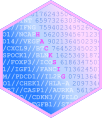

<!-- README.md is generated from README.Rmd. Please edit that file -->

```{r, include = FALSE}
knitr::opts_chunk$set(
  collapse = TRUE,
  comment = "#>",
  fig.path = "man/figures/README-",
  out.width = "100%"
)
options(tibble.print_min = 5L, tibble.print_max = 5L)
```

# hacksig 

<!-- badges: start -->
[](https://lifecycle.r-lib.org/articles/stages.html#experimental)
[](https://CRAN.R-project.org/package=hacksig)
[](https://app.codecov.io/gh/Acare/hacksig?branch=master)
[](https://github.com/Acare/hacksig/actions)
<!-- badges: end -->

The goal of `hacksig` is to provide a simple and tidy interface to compute single sample scores for gene signatures and methods applied in cancer transcriptomics.

Scores can be obtained either for custom lists of genes or for a manually curated collection of gene signatures, including:

  * [CINSARC](https://doi.org/10.1038/nm.2174);
  * [ESTIMATE](https://doi.org/10.1038/ncomms3612);
  * [Immunophenoscore](https://doi.org/10.1016/j.celrep.2016.12.019);
  * [Cytolitic activity](https://doi.org/10.1016/j.cell.2014.12.033);
  * and more (use `get_sig_info()` for a complete list of gene signatures implemented)

One can choose to apply either the original publication method or one of three single sample scoring alternatives, namely: combined z-score, single sample GSEA and singscore.

## Installation

You can install the released version of hacksig from [CRAN](https://CRAN.R-project.org) with:

```{r, eval=FALSE}
install.packages("hacksig")
```

Or the development version from [GitHub](https://github.com/) with:

```{r, eval=FALSE}
# install.packages("devtools")
devtools::install_github("Acare/hacksig")
```

## Citation

If you use `hacksig` in your work, please cite us with:

```{r}
citation("hacksig")
```


## Usage

You can learn more about usage of the package in `vignette("hacksig")`.

```{r, message=FALSE}
library(hacksig)
library(dplyr)
library(future)
```

### Get available signatures

```{r}
get_sig_info()
```

### Check your signatures

```{r}
check_sig(test_expr, signatures = "estimate")
```

### Compute single sample scores

```{r}
hack_sig(test_expr, signatures = c("ifng", "cinsarc"), method = "zscore")
```

### Stratify your samples

```{r}
test_expr %>% 
    hack_sig("estimate", method = "singscore", direction = "up") %>% 
    hack_class(cutoff = "median")
```

### Speed-up computation time

```{r}
plan(multisession)
hack_sig(test_expr, method = "ssgsea")
```


## Contributing

If you have any suggestions about adding new features or signatures to `hacksig`, please create an issue on [GitHub](https://github.com/Acare/hacksig/issues).
Gene-level information about gene signatures are stored in `data-raw/hacksig_signatures.csv` and can be used as a template for requests.
