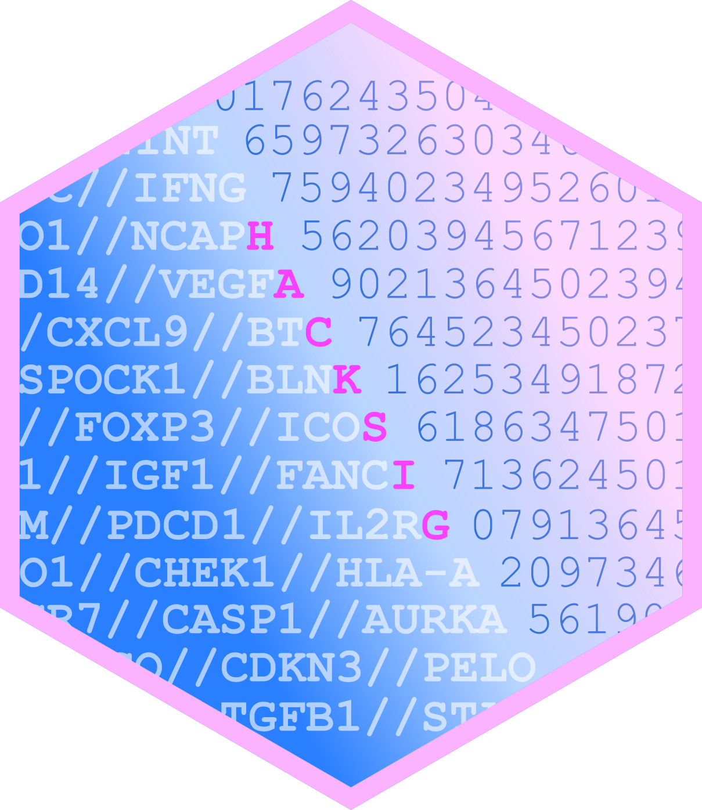

<!-- README.md is generated from README.Rmd. Please edit that file -->

# hacksig 

<!-- badges: start -->

[](https://lifecycle.r-lib.org/articles/stages.html#experimental)
[](https://CRAN.R-project.org/package=hacksig)
[](https://app.codecov.io/gh/Acare/hacksig?branch=master)
[](https://github.com/Acare/hacksig/actions)

<!-- badges: end -->

The goal of `hacksig` is to provide a simple and tidy interface to
compute single sample scores for gene signatures and methods applied in
cancer transcriptomics.

Scores can be obtained either for custom lists of genes or for a
manually curated collection of gene signatures, including:

- [CINSARC](https://doi.org/10.1038/nm.2174);
- [ESTIMATE](https://doi.org/10.1038/ncomms3612);
- [Immunophenoscore](https://doi.org/10.1016/j.celrep.2016.12.019);
- [Cytolitic activity](https://doi.org/10.1016/j.cell.2014.12.033);
- and more (use `get_sig_info()` to get a complete list of the
  implemented signatures)

The following table lists all the available gene signatures implemented
in hacksig (see also `get_sig_info()`):

At present, signature scores can be obtained either with the original
publication method or using one of three single sample scoring
alternatives, namely: *combined z-score*, *single sample GSEA* and
*singscore*.

## Installation

You can install the last stable version of hacksig from
[CRAN](https://CRAN.R-project.org) with:

``` r
install.packages("hacksig")
```

Or the development version from [GitHub](https://github.com/) with:

``` r
# install.packages("devtools")
devtools::install_github("Acare/hacksig")
```

## Citation

If you use `hacksig` in your work, please cite us with:

``` r
citation("hacksig")
#> 
#> To cite hacksig in publications use:
#> 
#>   Andrea Carenzo, Federico Pistore, Mara S Serafini, Deborah Lenoci,
#>   Armando G Licata, Loris De Cecco, hacksig: a unified and tidy R
#>   framework to easily compute gene expression signature scores,
#>   Bioinformatics, Volume 38, Issue 10, 15 May 2022, Pages 2940–2942,
#>   https://doi.org/10.1093/bioinformatics/btac161
#> 
#> A BibTeX entry for LaTeX users is
#> 
#>   @Article{,
#>     title = {hacksig: a unified and tidy R framework to easily compute gene expression signature scores},
#>     author = {Andrea Carenzo and Federico Pistore and Mara S. Serafini and Deborah Lenoci and Armando G. Licata and Loris {De Cecco}},
#>     journal = {Bioinformatics},
#>     doi = {10.1093/bioinformatics/btac161},
#>     year = {2022},
#>     volume = {38},
#>     number = {10},
#>     pages = {2940-2942},
#>     url = {https://doi.org/10.1093/bioinformatics/btac161},
#>   }
```

## Usage

You can learn more about usage of the package in `vignette("hacksig")`.

``` r
library(hacksig)
library(dplyr)
library(future)
```

### Available signatures

``` r
get_sig_info()
#> # A tibble: 23 × 4
#>   signature_id       signature_keywords                          publi…¹ descr…²
#>   <chr>              <chr>                                       <chr>   <chr>  
#> 1 ayers2017_immexp   ayers2017_immexp|immune expanded            10.117… Immune…
#> 2 bai2019_immune     bai2019_immune|head and neck|hnscc|inflamm… 10.115… Immune…
#> 3 cinsarc            cinsarc|metastasis|sarcoma|sts              10.103… Biomar…
#> 4 dececco2014_int172 dececco2014_int172|head and neck|hnscc      10.109… Signat…
#> 5 eschrich2009_rsi   eschrich2009_rsi|radioresistance|radiosens… 10.101… Genes …
#> # … with 18 more rows, and abbreviated variable names ¹​publication_doi,
#> #   ²​description
```

### Check your signatures

``` r
check_sig(test_expr, signatures = "estimate")
#> # A tibble: 2 × 5
#>   signature_id     n_genes n_present frac_present missing_genes
#>   <chr>              <int>     <int>        <dbl> <list>       
#> 1 estimate_stromal     141        91        0.645 <chr [50]>   
#> 2 estimate_immune      141        74        0.525 <chr [67]>
```

### Compute single sample scores

``` r
hack_sig(test_expr, signatures = c("ifng", "cinsarc"), method = "zscore")
#> # A tibble: 20 × 3
#>   sample_id cinsarc muro2016_ifng
#>   <chr>       <dbl>         <dbl>
#> 1 sample1   -0.482         -0.511
#> 2 sample10  -0.0926        -1.60 
#> 3 sample11   0.730         -1.03 
#> 4 sample12  -0.625          0.851
#> 5 sample13   0.930         -0.369
#> # … with 15 more rows
```

### Stratify your samples

``` r
test_expr %>% 
    hack_sig("estimate", method = "singscore", direction = "up") %>% 
    stratify_sig(cutoff = "median")
#> # A tibble: 20 × 3
#>   sample_id estimate_immune estimate_stromal
#>   <chr>     <chr>           <chr>           
#> 1 sample1   low             low             
#> 2 sample2   high            low             
#> 3 sample3   low             low             
#> 4 sample4   low             high            
#> 5 sample5   low             high            
#> # … with 15 more rows
```

### Speed-up computation time

``` r
plan(multisession)
hack_sig(test_expr, method = "ssgsea")
#> Warning: ℹ No genes are present in 'expr_data' for the following signatures:
#> ✖ rooney2015_cyt
#> # A tibble: 20 × 23
#>   sample_id ayers2017_…¹ bai20…² cinsarc decec…³ eschr…⁴ estim…⁵ estim…⁶ eusta…⁷
#>   <chr>            <dbl>   <dbl>   <dbl>   <dbl>   <dbl>   <dbl>   <dbl>   <dbl>
#> 1 sample1            NaN     NaN     NaN     NaN     NaN     NaN     NaN     NaN
#> 2 sample10           NaN     NaN     NaN     NaN     NaN     NaN     NaN     NaN
#> 3 sample11           NaN     NaN     NaN     NaN     NaN     NaN     NaN     NaN
#> 4 sample12           NaN     NaN     NaN     NaN     NaN     NaN     NaN     NaN
#> 5 sample13           NaN     NaN     NaN     NaN     NaN     NaN     NaN     NaN
#> # … with 15 more rows, 14 more variables: fang2021_irgs <dbl>,
#> #   hu2021_derbp <dbl>, ips_cp <dbl>, ips_ec <dbl>, ips_mhc <dbl>,
#> #   ips_sc <dbl>, li2021_irgs <dbl>, liu2020_immune <dbl>, liu2021_mgs <dbl>,
#> #   lohavanichbutr2013_hpvneg <dbl>, muro2016_ifng <dbl>, qiang2021_irgs <dbl>,
#> #   she2020_irgs <dbl>, wu2020_metabolic <dbl>, and abbreviated variable names
#> #   ¹​ayers2017_immexp, ²​bai2019_immune, ³​dececco2014_int172, ⁴​eschrich2009_rsi,
#> #   ⁵​estimate_immune, ⁶​estimate_stromal, ⁷​eustace2013_hypoxia
```

## Contributing

If you have any suggestions about adding new features or signatures to
`hacksig`, please create an issue on
[GitHub](https://github.com/Acare/hacksig/issues). Gene-level
information about gene signatures are stored in
`data-raw/hacksig_signatures.csv` and can be used as a template for
requests.
